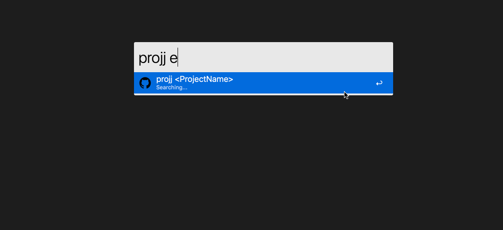

# alfred-plugin-projj

Alfred plugin for https://github.com/popomore/projj

[![NPM version][npm-image]][npm-url]
[![build status][travis-image]][travis-url]
[![Test coverage][codecov-image]][codecov-url]
[![David deps][david-image]][david-url]
[![Known Vulnerabilities][snyk-image]][snyk-url]
[![NPM download][download-image]][download-url]

[npm-image]: https://img.shields.io/npm/v/alfred-plugin-projj.svg?style=flat-square
[npm-url]: https://npmjs.org/package/alfred-plugin-projj
[travis-image]: https://img.shields.io/travis/{{org}}/alfred-plugin-projj.svg?style=flat-square
[travis-url]: https://travis-ci.org/{{org}}/alfred-plugin-projj
[codecov-image]: https://codecov.io/gh/{{org}}/alfred-plugin-projj/branch/master/graph/badge.svg
[codecov-url]: https://codecov.io/gh/{{org}}/alfred-plugin-projj
[david-image]: https://img.shields.io/david/{{org}}/alfred-plugin-projj.svg?style=flat-square
[david-url]: https://david-dm.org/{{org}}/alfred-plugin-projj
[snyk-image]: https://snyk.io/test/npm/alfred-plugin-projj/badge.svg?style=flat-square
[snyk-url]: https://snyk.io/test/npm/alfred-plugin-projj
[download-image]: https://img.shields.io/npm/dm/alfred-plugin-projj.svg?style=flat-square
[download-url]: https://npmjs.org/package/alfred-plugin-projj

## Usage



1. Install [projj](https://github.com/popomore/projj)

```bash
$ npm i projj -g
$ projj init
```

2. Install [Alfred](https://www.alfredapp.com/workflows/)

3. Install Workflow:

```bash
$ npm i alfred-plugin-projj -g
```
